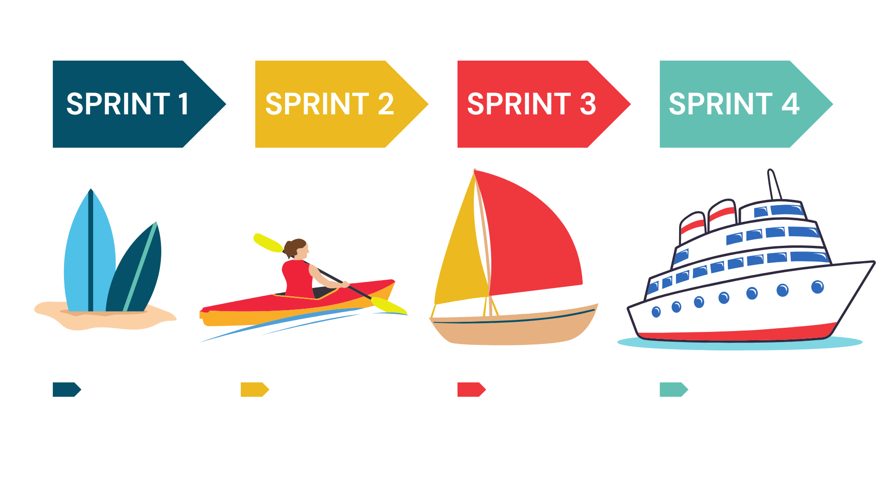

# Plataforma-SCRUM

  

     <a href ="#objetivo">Objetivo</a>  •
     <a href ="#desafio">Desafio</a>  •
     <a href ="#mvp">MVP</a>  •
     <a href ="#backlog">Backlog</a>  •
     <a href ="#requisitos">Requisitos</a>  •
     <a href ="#equipe">Equipe</a>
   

## 🎯 Objetivo 
Projeto dos alunos do 1° semestre do curso de Análise e Desenvolvimento de Sistemas da FATEC-SJC, com o objetivo de criar uma aplicação web de instruções para o desenvolvimento do framework Scrum na área de TI.

## ⚙ Desafio 
Desenvolver um sistema web que indique todos os processos e artefatos da metodologia ágil
(Scrum), todos os processos deverão ter conceitos e fundamentos com referências, bem como a
aplicação com exemplos práticos para a plena compreensão do usuário do sistema.
Deverá criar um formulário para avaliações parciais e final (com totalização).
O Sistema deve primordialmente ter foco na disseminação dos processos para que os usuários
possam replicar todos os passos em futuros desenvolvimentos.
A prioridade secundária será a compreensão de habilidades (Skills) importantes para um
profissional de tecnologia da informação.
Todo o material de conhecimento publicado no sistema deverá ter forma indireta (Conhecimento
adquirido e repassado pelos desenvolvedores).
Bem como toda a documentação de desenvolvimento deverá ser lastreado no GitHub com todos
os processos necessários para a fidelização do cliente.

## 🥇 MVP 

     

     

## 📋 Backlog do Produto 
| Sprint | US | Tarefa | Prioridade | Status | Entrega |
| ------ | -- | ------ | ---------- | ------ | ------- |
| 1 | "Eu, como desenvolvedor, quero lsitas as principais tarefas a seram desenvolvidas no projeto. " | Elaboração do Backlog | 100 | ✅ | 24/09 |
| 1 | "Eu, como cliente, quero uma uma vi~sao geral do projeto por meio de um protótipo." | Projeção do Protótipo navegável no Figma | 95 | ✅ | 24/09 |
| 1 | "Eu, como cliente, quero um repositório para acompanhar a evolução do projeto e visualizar a documentação." | Criação do Github do projeto | 90 | ✅ | 24/09 |
| 1 | "Eu, como usuário, quero clareza no ensino, para facilitar a aprendizagem do método Scrum." | Síntese do conteúdo nas páginas | 85 | ✅ | 24/09 |
| 2 | "Eu, como desenvolvedor, quero estruturar o site em HTML, para garantir o bom funcionamento do sistema." | Marcação do site em HTML | 80 | ✅ | 15/10 |
| 2 | "Eu, como desenvolvedor, quero usar o CSS para estilizar o site." | Estilizaçao do site em CSS | 75 | ✅ | 15/10 |
| 2 | "Eu, como usuário, quero uma barra de navegação para facilitar a transição entre páginas." | Barra de navegação | 60 | ✅ | 15/10 |
| 3 | "Eu, como cliente, quero um formulário para avaliar o conhecimento dos meus colaboradores." | Avaliação de conteúdo | 50 | 🛠️ | 05/11 |
| 3 | "Eu, como desenvolvedor, quero sugerir outros conteúdos para ampliar o contato do usuário com o método." | Sugestão de conteúdo (ferramentas, leitura, vídeos) | 35 | 🛠️ | 05/11 |
| 4 | "Eu, como desenvolvedor, quero revisar todo site em busca de possíveis falhas." | Revisão geral do produto | 25 | 🛑 | 26/11 |
| 4 | "Eu, como desenvolvedor, quero que seja possível utilizar o site num dispositivo móvel." | Responsividade do sistema | 20 | 🛑 | 26/11 |

  ### 1° Sprint
  

  <a href ="https://www.figma.com/proto/zMqLJJIwJ5Tw2HcVC3Mo9C/PrototipoFigma?page-id=0%3A1&type=design&node-id=1-22&viewport=9575%2C5381%2C0.53&t=oJcADT6DMsE9rUeG-1&scaling=min-zoom&starting-point-node-id=2%3A110&mode=design">Link para o protótipo no Figma</a>

  <a href ="https://youtu.be/9_RjVpeYKVo?si=0Un3n2u2dpyAXk-a">Apresentação no Youtube</a>

   #### Backlog da Sprint 1

   ## 📋 Backlog da Sprint 
| Responsável | Atividade | Início | Duração | Término |
| ------- | ------- | ------- | ------- | ------- |
| Breno | Criação do GitHub do Projeto | 04/09/2023 | 1 | 04/09/2023 |
| Breno | Elaboração do Backlog do Produto | 04/09/2023 | 8 | 11/09/2023 |
| Equipe | Estudo da Ferramenta Figma | 04/09/2023 | 3 | 06/09/2023 |
| Equipe | Estudo da Ferramenta GitHub e Git | 04/09/2023 | 3 | 06/09/2023 |
| Equipe | Projeção do Protótipo Navegável | 04/09/2023 | 8 | 11/09/2023 |
| Gabriel / Allan | Montagem do Protótipo / Página Home | 12/09/2023 | 3 | 14/09/2023 |
| André / Mariane | Montagem do Protótipo / Página Módulo | 15/09/2023 | 6 | 20/09/2023 |
| Matheus | Revisão do Layout | 21/09/2023 | 2 | 22/09/2023 |
| Paloma | Elaboração do Slide de Apresentação da Sprint | 18/09/2023 | 5 | 22/09/2023 |
| Matheus | Gravação do Vídeo de Apresentação | 21/09/2023 | 2 | 22/09/2023 |

  
  ### 2° Sprint

   #### Backlog da Sprint 2
   ## 📋 Backlog da Sprint 
| Responsável | Atividade | Início | Duração | Término |
| ------- | ------- | ------- | ------- | ------- |
| Gabriel | Página Home / Barra de Navegação | 29/09/2023 | 4 | 02/10/2023 |
| Breno / Gabriel | Módulo 1 | 29/09/2023 | 10 | 08/10/2023 |
| Allan / Mariane | Módulo 2 | 29/09/2023 | 14 | 12/10/2023 |
| André / Paloma | Módulo 3 | 29/09/2023 | 12 | 10/10/2023 |
| Matheus | Sistema de Avaliação dos Módulos | 29/09/2023 | 9 | 06/10/2023 |
| Paloma | Elaboração do Slide de Apresentação da Sprint | 09/10/2023 | 5 | 13/10/2023 |
| Breno | Montagem do Gif (vídeo do protótipo) | 13/10/2023 | 1 | 13/10/2023|

## 🗂 Requisitos 

   
Funcionais:

   <ul>
      <li> Linguagem Python (Requisito Fatec)</li>
      <li> Linguagem HTML e CSS (Requisito Fatec)</li>
      <li> Uso do framework Bootstrap</li>
      <li> Apresentação via Github</li>
      <li>O sistema web deverá ser intuitivo e não ter poluições de informações, isso deverá ser
      uma preocupação constante dos desenvolvedores sugestões de controles serão bem-
      vindas e bem avaliadas.</li>
      <li>Criar um sistema de avaliação (Processo, Produto e Conhecimento em disciplina, SM., PO., TD)</li>
      <li>Processo Scrum</li>
      <li>Burndown</li>
      <li>Product Backlog</li>
      <li>Sprint</li>
      <li>Sprint Planning</li>
      <li>Sprint Review</li>
      <li>Sprint Backlog</li>
      <li>Dailys</li>
      <li>Retrospective</li>
      <li>DOR – Definition of Ready</li>
      <li>DOD – Definition of Done</li>
      <li>Planning Poker</li>
      <li>Kanban</li>
      <li>Artefatos do Scrum</li>
      <li>MVP</li>
   <ul>

   
Não funcionais:

   <ul>
      <li>Documentação via Github</li>
      <li>Linguagem de programação Python, framework Flask.</li>
      <li>Linguagem de marcação HTML e CSS.</li>
   </ul>

## 🌎 Equipe 

| Nome | Cargo | Github | Linkedin |
| ---- | ----- | ------ | -------- | 
| Paloma Lima da Silva | Scrum Master |   |  |
| Breno Augusto Santos Jesus  | Product Owner |   |  |
| André Augustos M. Neves | Dev Team |  |  |
| Allan Rafael Pereira da Silva | Dev Team |  |  |
| Gabriel Felipe Côrrea da Silva | Dev Team |  |  |
| Mariane de Sousa Ferreira | Dev Team |  |  |
| Matheus de Sousa Nascimento Marques | Dev Team | |  |

