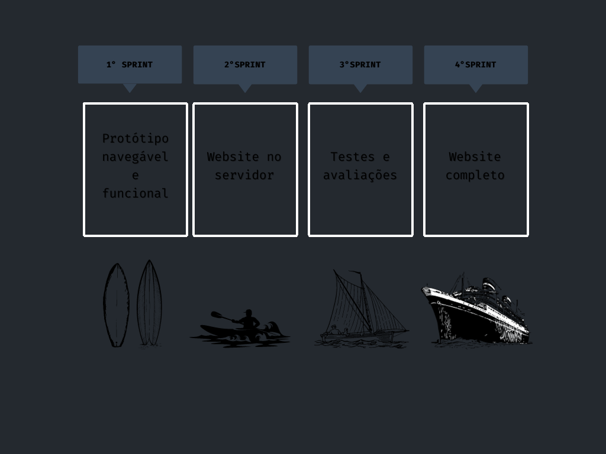

# Plataforma-SCRUM

  

     <a href ="#objetivo">Objetivo</a>  •
     <a href ="#desafio">Desafio</a>  •
     <a href ="#mvp">MVP</a>  •
     <a href ="#backlog">Backlog</a>  •
     <a href ="#requisitos">Requisitos</a>  •
     <a href ="#equipe">Equipe</a>
   

## 🯠Objetivo 
Projeto dos alunos do 1° semestre do curso de Análise e Desenvolvimento de Sistemas da FATEC-SJC, com o objetivo de criar uma aplicação web de instruções para o desenvolvimento do framework Scrum na área de TI.

## ⚙ Desafio 
Desenvolver um sistema web que indique todos os processos e artefatos da metodologia ágil
(Scrum), todos os processos deverão ter conceitos e fundamentos com referências, bem como a
aplicação com exemplos práticos para a plena compreensão do usuário do sistema.
Deverá criar um formulário para avaliações parciais e final (com totalização).
O Sistema deve primordialmente ter foco na disseminação dos processos para que os usuários
possam replicar todos os passos em futuros desenvolvimentos.
A prioridade secundária será a compreensão de habilidades (Skills) importantes para um
profissional de tecnologia da informação.
Todo o material de conhecimento publicado no sistema deverá ter forma indireta (Conhecimento
adquirido e repassado pelos desenvolvedores).
Bem como toda a documentação de desenvolvimento deverá ser lastreado no GitHub com todos
os processos necessários para a fidelização do cliente.

## 🥇 MVP 

     

     

## 📋 Backlog 
| Sprint | Tarefa | Prioridade | Status | Entrega |
| ------ | ------ | ---------- | ------ | ------- |
| 1 | Elaboração do Backlog | Imprescindível | ✅ | 24/09 |
| 1 | Projeção do Protótipo navegável no Figma | Imprescindível | ✅ | 24/09 |
| 1 | Criação do Github do projeto | Importante | ✅ | 24/09 |
| 1 | Síntese do conteúdo nas páginas | Importante | ✅ | 24/09 |
| 2 | Marcação do site em HTML | Imprescindível | 🛑 | - |
| 2 | Estilizaçao do site em CSS | Importante | 🛑 | - |
| 2 | Barra de navegação | Importante | 🛑 | - |
| 3 | Avaliação de conteúdo | Imprescindível | 🛑 | - |
| 3 | Sugestão de conteúdo (ferramentas, leitura, vídeos) | Desejado | 🛑 |- |
| 4 | Revisão geral do produto | Imprescindível | 🛑 | - |
| 4 | Responsividade do sistema | Desejado | 🛑 | - |

  ### 1ª Sprint
  

  <a href ="https://www.figma.com/proto/zMqLJJIwJ5Tw2HcVC3Mo9C/PrototipoFigma?page-id=0%3A1&type=design&node-id=1-22&viewport=9575%2C5381%2C0.53&t=oJcADT6DMsE9rUeG-1&scaling=min-zoom&starting-point-node-id=2%3A110&mode=design">Link para o protótipo no Figma</a>

  <a href ="https://youtu.be/9_RjVpeYKVo?si=0Un3n2u2dpyAXk-a">Apresentação no Youtube</a>

   #### Backlog da Sprint
   

   #### Burndown
   

## 🗂 Requisitos 

   
Funcionais:

   <ul>
      <li> Linguagem Python (Requisito Fatec)</li>
      <li> Linguagem HTML e CSS (Requisito Fatec)</li>
      <li> Uso do framework Bootstrap</li>
      <li> Apresentação via Github</li>
      <li>O sistema web deverá ser intuitivo e não ter poluições de informações, isso deverá ser
      uma preocupação constante dos desenvolvedores sugestões de controles serão bem-
      vindas e bem avaliadas.</li>
      <li>Criar um sistema de avaliação (Processo, Produto e Conhecimento em disciplina, SM., PO., TD)</li>
      <li>Processo Scrum</li>
      <li>Burndown</li>
      <li>Product Backlog</li>
      <li>Sprint</li>
      <li>Sprint Planning</li>
      <li>Sprint Review</li>
      <li>Sprint Backlog</li>
      <li>Dailys</li>
      <li>Retrospective</li>
      <li>DOR – Definition of Ready</li>
      <li>DOD – Definition of Done</li>
      <li>Planning Poker</li>
      <li>Kanban</li>
      <li>Artefatos do Scrum</li>
      <li>MVP</li>
   <ul>

   
Não funcionais:

   <ul>
      <li>Documentação via Github</li>
      <li>Linguagem de programação Python, framework Flask.</li>
      <li>Linguagem de marcação HTML e CSS.</li>
   </ul>

## 🌠Equipe 

| Nome | Cargo | Github | Linkedin |
| ---- | ----- | ------ | -------- | 
| Paloma Lima da Silva | Scrum Master |   |  |
| Breno Augusto Santos Jesus  | Product Owner |   |  |
| André Augustos M. Neves | Dev Team |  |  |
| Allan Rafael Pereira da Silva | Dev Team |  |  |
| Gabriel Felipe Côrrea da Silva | Dev Team |  |  |
| Mariane de Sousa Ferreira | Dev Team |  |  |
| Matheus de Sousa Nascimento Marques | Dev Team | |  |

